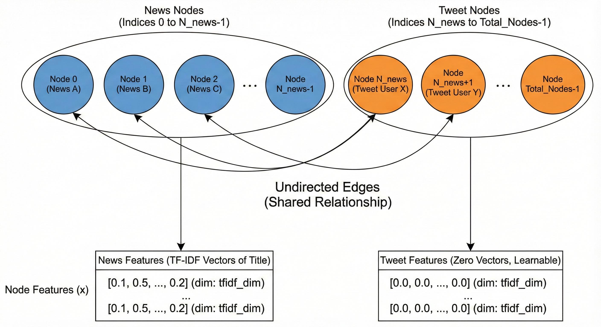

# Code Explanation: `main.py`

This document provides a detailed breakdown of the `main.py` script, which is the core entry point for training and evaluating the Graph Neural Network (GNN) models.

## 1. Imports and Setup
The script imports necessary libraries:
-   **`torch` & `torch_geometric`**: For building and training GNNs.
-   **`pandas` & `numpy`**: For data manipulation.
-   **`sklearn`**: For TF-IDF vectorization and metrics (accuracy, F1).
-   **`spacy`**: For natural language preprocessing.

## 2. Data Loading & Preprocessing
### `load_minimal_fakenewsnet(fake_path, real_path)`
-   **Purpose**: Loads the raw CSV files for fake and real news.
-   **Logic**:
    -   Reads both CSVs.
    -   Assigns label `0` to fake news and `1` to real news.
    -   Concatenates them into a single DataFrame.

### `preprocess_title_spacy(title)`
-   **Purpose**: Cleans and normalizes the news titles.
-   **Logic**:
    -   Uses `spacy` to tokenize the text.
    -   Removes stop words, punctuation, and short words.
    -   **Lemmatizes** tokens (converts them to their root form) to reduce vocabulary size.

## 3. Graph Construction
### `build_graph_from_df(df, tfidf_dim)`
This is the most critical function. It converts the tabular data into a graph structure compatible with PyTorch Geometric.

1.  **Node Identification**:
    -   Identifies all unique **News** articles.
    -   Identifies all unique **Tweets** (users) that shared these articles.
    -   Maps them to continuous indices: News nodes come first `[0, ..., N_news-1]`, followed by Tweet nodes.

2.  **Edge Creation**:
    -   Iterates through the DataFrame.
    -   Creates an edge between a **Tweet** and a **News** article if that tweet ID appears in the article's `tweet_ids`.
    -   **Undirected Graph**: Adds reverse edges so information flows both ways (News <-> Tweet).

3.  **Feature Engineering**:
    -   **News Nodes**: Uses `TfidfVectorizer` to convert preprocessed titles into numerical vectors of size `tfidf_dim` (default 512).
    -   **Tweet Nodes**: Since we don't have tweet text, they are initialized with **zero vectors**. This allows the model to learn their embeddings purely based on the graph structure (who they interact with).

4.  **Output**: Returns a `Data` object containing `x` (features), `edge_index` (connectivity), and `y` (labels).

## 4. Masking (Train/Val/Test Split)
### `build_masks_for_news_nodes(...)`
-   **Purpose**: Defines which nodes are used for training, validation, and testing.
-   **Important**: We **only** mask News nodes. Tweet nodes are part of the graph structure but do not have labels we are trying to predict, so they are excluded from the loss calculation.
-   **Split**: Typically 70% Train, 15% Validation, 15% Test.

## 5. Model Definitions
Two GNN architectures are defined:

### `GCN` (Graph Convolutional Network)
-   Uses `GCNConv` layers.
-   **Structure**: `Input -> GCNConv -> ReLU -> Dropout -> GCNConv -> Output`.
-   Aggregates information from neighbors using a fixed normalization.

### `GAT` (Graph Attention Network)
-   Uses `GATConv` layers.
-   **Structure**: `Input -> GATConv (4 heads) -> ELU -> Dropout -> GATConv (1 head) -> Output`.
-   **Attention**: Learns *weights* for edges, allowing the model to prioritize more important neighbors.

## 6. Training Pipeline
### `train(...)`
-   Performs one step of gradient descent.
-   Calculates `CrossEntropyLoss` **only** on training nodes (`mask_train`).

### `evaluate(...)`
-   Computes Accuracy and F1-Score.
-   Can be used for both Validation and Test sets by passing the appropriate mask.

### `run_pipeline(...)`
-   Orchestrates the entire flow:
    1.  Loads data.
    2.  Builds the graph.
    3.  Initializes the chosen model (GCN or GAT).
    4.  Runs the training loop for `epochs`.
    5.  Tracks the best validation F1-score to save the best model state.
    6.  Reports final Test results.
